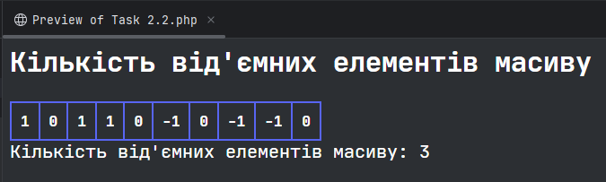
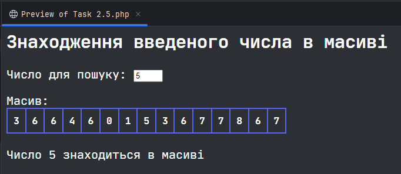
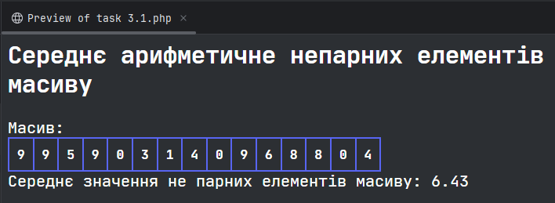
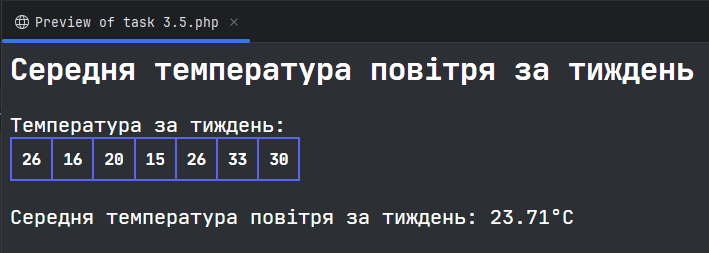
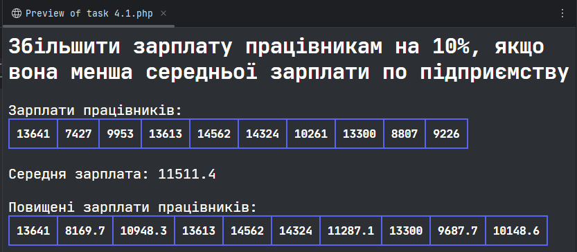
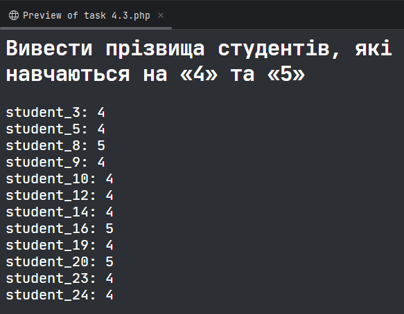
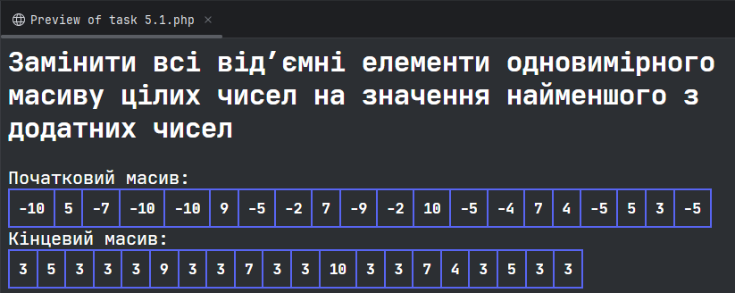
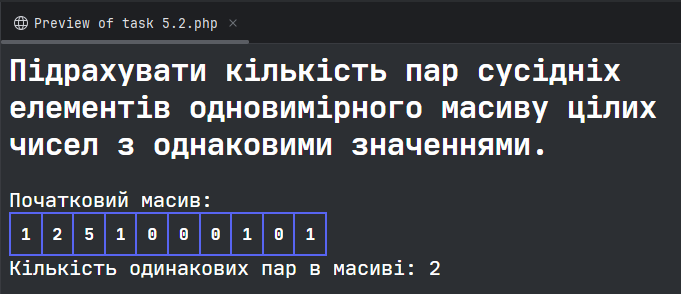
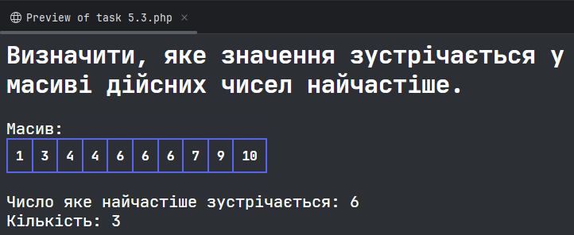

# Практична робота №4-5
### Жеревчук Сергій, 34 група
### Варіант 4

Код `utils.php` функції з якого використовуються в завданнях
```php
<?php
    function generate_array($length, $min, $max) {
        $array = [];

        for ($i = 0; $i < $length; $i++) {
            $array[] = rand($min, $max);
        }

        return $array;
    }

    function show_array($array, $title)
    {
        echo "$title: <table>";

        foreach ($array as $value) {
            echo "<th>$value</th>";
        }

        echo "</table>";
    }

```


## 2.2 Написати програму, яка підраховує кількість від’ємних елементів масиву

```php
<?php
    include_once "utils.php";

    $array = generate_array(10, -1, 1);

    $negative_numbers = 0;

    echo "<table>";

    foreach ($array as $value) {
        echo "<th>$value</th>";

        if ($value < 0) {
            $negative_numbers++;
        }
    }

    echo "</table>";

    echo "Кількість від'ємних елементів масиву: $negative_numbers";
```


## 2.5 Написати програму, яка визначає, чи зустрічається у масиві введене з клавіатури число

```php
<form name="form" action="" method="post">
    <label for="number">Число для пошуку: </label>
    <input type="number" name="number" id="number" style="width: 50px;"><br>
</form>

<?php
    include_once "utils.php";

    $array = generate_array(15, 0, 10);

    show_array($array, "Масив");
    echo "<br>";

    if ($_SERVER["REQUEST_METHOD"] == "POST") {
        $number = $_POST["number"];
        
        if (in_array($number, $array)) {
            echo "Число $number знаходиться в масиві";
        } else {
            echo "Число $number не знаходиться в масиві";
        }
    }
```


## 3.1 Написати програму, яка визначає середнє арифметичне непарних елементів масиву

```php
<?php
    include_once "utils.php";

    $array = generate_array(15, 0, 10);

    show_array($array, "Масив");
    
    $odd_array = array_filter($array, function ($elem) {return $elem % 2 != 0;});
    $odd_average = round(array_sum($odd_array) / count($odd_array), 2);
    
    echo "Середнє значення не парних елементів масиву: $odd_average";
```


## 3.5 Написати програму, яка визначає середню температуру повітря за тиждень

```php
<?php
    include_once "utils.php";

    $array = generate_array(7, 15, 35);

    show_array($array, "Температура за тиждень");
    
    $average_temperature = sprintf("%.2f", array_sum($array) / count($array));
    
    echo "<br>Середня температура повітря за тиждень: {$average_temperature}°С";
```


## 4.1 Складіть програму. Відомо зарплати працівників підприємства. Збільшити зарплату працівникам на 10%, якщо вона менша середньої зарплати по підприємству (середню зарплату визначити у програмі)

```php
<?php
    include_once "utils.php";

    $wages = generate_array(10, 7000, 15000);

    show_array($wages, "Зарплати працівників");
    
    $average_wage = array_sum($wages) / count($wages);
    
    $new_wages = array_map(function ($wage) use ($average_wage) {
        if ($wage < $average_wage) {
            return $wage + ($wage * 0.1);
        } else {
            return $wage;
        }
    }, $wages);
    
    echo "<br>Середня зарплата: $average_wage<br><br>";
    
    show_array($new_wages, "Повищені зарплати працівників");
```


## 4.3 Складіть програму. Відомо середній бал студентів першого курсу. Вивести прізвища студентів, які навчаються на «4» та «5».

```php
<?php
    include_once "utils.php";
    
    $students = [];

    for ($i = 0; $i < 25; ++$i) {
        $students["student_$i"] = rand(2, 5);
    }

    foreach ($students as $student => $grade) {
        if ($grade > 3) {
            echo "$student: $grade<br>";
        }
    }
```


## 5.1 Замінити всі від’ємні елементи одновимірного масиву цілих чисел на значення найменшого з додатних чисел (нуль не враховувати).

```php
<?php
    include_once "utils.php";

    $array = generate_array(20, -10, 10);
    $min_positive = 10;
    
    show_array($array, "Початковий масив");

    foreach ($array as $value) {
        $min_positive = ($value < $min_positive) && ($value > 0) ? $value : $min_positive;
    }

    foreach ($array as $key => $value) {
        $array[$key] = $value < 0 ? $min_positive : $value;
    }
    unset($value);

    show_array($array, "Кінцевий масив");
```


## 5.2 Підрахувати кількість пар сусідніх елементів одновимірного масиву цілих чисел з однаковими значеннями.

```php
<?php
    include_once "utils.php";

    $array = generate_array(10, 0, 5);
    
    show_array($array, "Початковий масив");

    $count_of_couples = 0;

    for ($i = 0; $i < count($array) - 1; $i++) {
        if ($array[$i] == $array[$i + 1]) {
            $count_of_couples++;
        }
    }

    echo "Кількість одинакових пар в масиві: $count_of_couples";
```


# 5.3 Визначити, яке значення зустрічається у масиві дійсних чисел найчастіше.

```php
<?php
    include_once "utils.php";

    $array = generate_array(10, 0, 10);
    sort($array);
    
    show_array($array, "Масив");

    $number = 0;
    $frequency = 0;
    $current_number = $array[0];
    $current_frequency = 0;

    foreach ($array as $value) {
        if ($current_number != $value) {
            if ($current_frequency > $frequency) {
                $number = $current_number;
                $frequency = $current_frequency;
            }
            
            $current_number = $value;
            $current_frequency = 1;
            
            continue;
        }
        
        $current_frequency++;
    }

    echo "<br>Число яке найчастіше зустрічається: $number<br>";
    echo "Кількість: $frequency";
```
